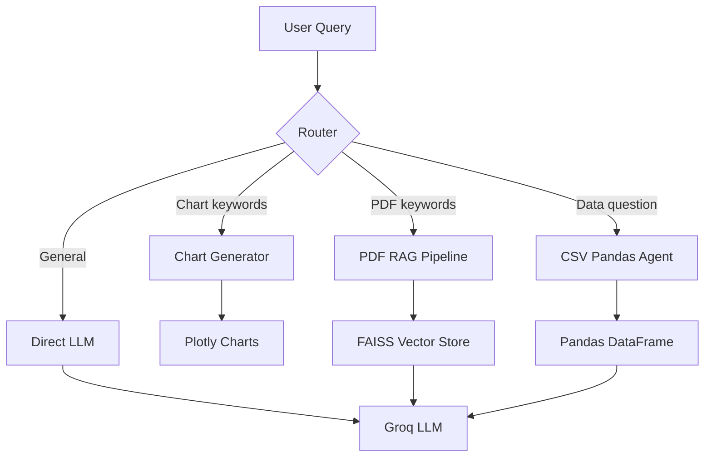

# 📊 AI Financial Analyst Agent

A production-ready AI-powered financial analysis assistant built with Streamlit, LangChain, and Groq. Upload CSV data or PDF documents, ask questions in plain English, and get instant insights, interactive charts, and AI-driven answers.


---

## ✨ Features

| Feature | Description |
|---------|-------------|
| 📄 **CSV Analysis** | Upload any CSV — ask questions, get insights via AI-powered pandas agent |
| 📑 **PDF Q&A** | Upload **any** PDF (reports, papers, contracts) — search and query with RAG |
| 📊 **Smart Charts** | Auto-generates bar, line, pie, scatter, histogram charts from natural language |
| 🧠 **General AI** | Ask any finance question — even without uploading data |
| 🎨 **Premium UI** | Glassmorphism dark theme with animations and responsive design |
| 🔒 **Production-Ready** | Input validation, error handling, retry logic, structured logging |

---

## 🏗️ Architecture



---

## 🚀 Quick Start

### Prerequisites

- Python 3.11+
- A free [Groq API key](https://console.groq.com/keys)

### Local Setup

```bash
# 1. Clone the repo
git clone <your-repo-url>
cd financial_analyst_agent

# 2. Create virtual environment
python -m venv venv
venv\Scripts\activate        # Windows
# source venv/bin/activate   # macOS/Linux

# 3. Install dependencies
pip install -r requirements.txt

# 4. Configure environment
cp .env.example .env
# Edit .env and add your GROQ_API_KEY

# 5. Run the app
streamlit run app.py
```

The app will open at `http://localhost:8501`.

### Docker

```bash
# Build
docker build -t financial-analyst .

# Run
docker run -p 8501:8501 --env-file .env financial-analyst
```

---

## 📁 Project Structure

```
financial_analyst_agent/
├── app.py                    # Main Streamlit application
├── src/
│   ├── config.py             # Configuration, validation, logging
│   ├── llm.py                # LLM factory with retry logic
│   ├── csv_agent.py          # CSV analysis (pandas agent)
│   ├── pdf_rag.py            # PDF RAG pipeline (generalized)
│   ├── charts.py             # Chart generation & column detection
│   ├── router.py             # Question routing logic
│   └── utils.py              # File validation, helpers
├── tests/                    # Unit tests
├── .streamlit/config.toml    # Streamlit production config
├── Dockerfile                # Container deployment
├── requirements.txt          # Python dependencies
├── .env.example              # Environment template
└── learning/                 # Archived learning scripts (day 1-5)
```

---

## ⚙️ Configuration

All settings can be customized via environment variables in `.env`:

| Variable | Default | Description |
|----------|---------|-------------|
| `GROQ_API_KEY` | *required* | Your Groq API key |
| `MODEL_NAME` | `llama-3.3-70b-versatile` | LLM model to use |
| `MODEL_TEMPERATURE` | `0` | Response creativity (0 = deterministic) |
| `MAX_CSV_SIZE_MB` | `50` | Max CSV upload size |
| `MAX_PDF_SIZE_MB` | `20` | Max PDF upload size |
| `CHUNK_SIZE` | `1000` | RAG text chunk size |
| `CHUNK_OVERLAP` | `200` | RAG chunk overlap |
| `RETRIEVER_TOP_K` | `4` | Number of RAG chunks to retrieve |
| `LOG_LEVEL` | `INFO` | Logging level |

---

## 🧪 Testing

```bash
pytest tests/ -v
```

---

## 🚢 Deployment

### Streamlit Cloud

1. Push your code to GitHub (ensure `.env` is in `.gitignore`)
2. Go to [share.streamlit.io](https://share.streamlit.io)
3. Connect your repo and set `GROQ_API_KEY` in Secrets

### Docker / Cloud VM

```bash
docker build -t financial-analyst .
docker run -d -p 8501:8501 --env-file .env --restart unless-stopped financial-analyst
```

---

## 📝 License

MIT License — see [LICENSE](LICENSE) for details.
