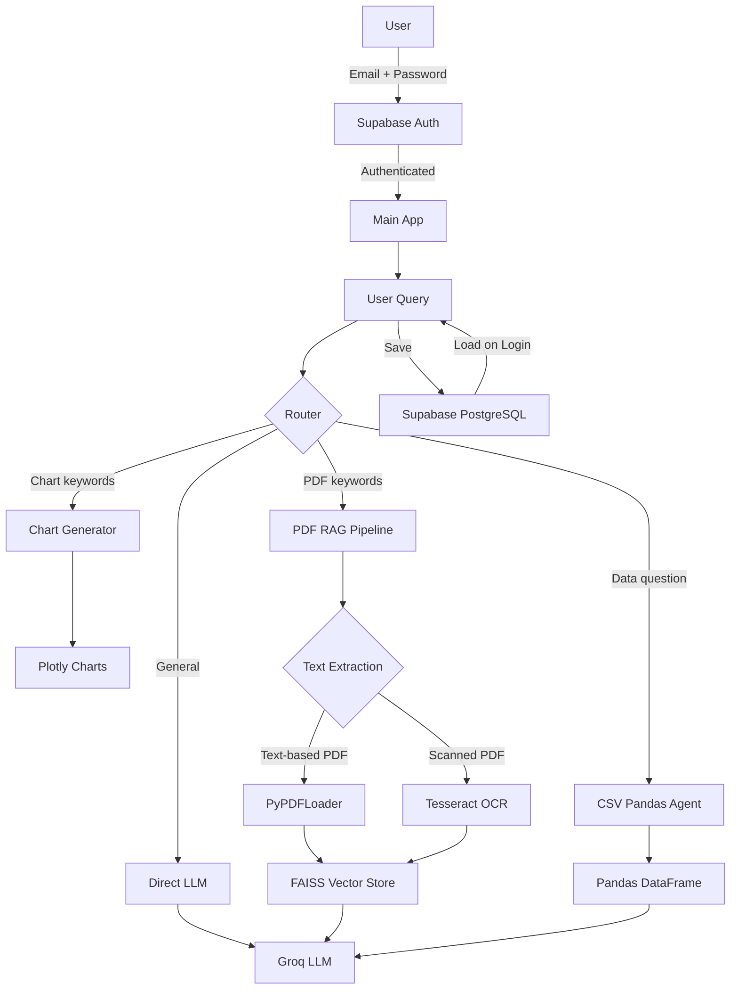

# 📊 AI Financial Analyst Agent

A production-ready AI-powered financial analysis assistant built with Streamlit, LangChain, and Groq. Upload CSV data or PDF documents, ask questions in plain English, and get instant insights, interactive charts, and AI-driven answers — with user authentication and persistent chat history.


---

## ✨ Features

| Feature | Description |
|---------|-------------|
| 🔐 **User Authentication** | Supabase email/password signup & login — each user gets their own workspace |
| 💾 **Persistent Chat History** | Conversations are saved to Supabase PostgreSQL and restored on login |
| 📄 **CSV Analysis** | Upload any CSV — ask questions, get insights via AI-powered pandas agent |
| 📑 **PDF Q&A** | Upload **any** PDF (reports, papers, contracts) — search and query with RAG |
| 🔍 **OCR for Scanned PDFs** | Automatically extracts text from scanned/image-only PDFs using Tesseract OCR |
| 📊 **Smart Charts** | Auto-generates bar, line, pie, scatter, histogram charts from natural language |
| 🎤 **Voice Input** | Speak your questions — transcribed via Groq Whisper |
| 🧠 **General AI** | Ask any finance question — even without uploading data |
| 🎨 **Premium UI** | Dark/light theme with glassmorphism design and responsive layout |
| 🔒 **Production-Ready** | Input validation, error handling, retry logic, structured logging |

---

## 🏗️ Architecture


```mermaid
graph TB
    A[User] -->|Email + Password| B[Supabase Auth]
    B -->|Authenticated| C[Main App]

    C --> D[User Query]
    D --> E{Router}
    E -->|Chart keywords| F[Chart Generator]
    E -->|PDF keywords| G[PDF RAG Pipeline]
    E -->|Data question| H[CSV Pandas Agent]
    E -->|General| I[Direct LLM]

    F --> J[Plotly Charts]
    G --> K{Text Extraction}
    K -->|Text-based PDF| L[PyPDFLoader]
    K -->|Scanned PDF| M[Tesseract OCR]
    L --> N[FAISS Vector Store]
    M --> N
    H --> O[Pandas DataFrame]
    I --> P[Groq LLM]

    N --> P
    O --> P

    D -->|Save| Q[Supabase PostgreSQL]
    Q -->|Load on Login| D
```

---

## 🚀 Quick Start

### Prerequisites

- Python 3.11+
- A free [Groq API key](https://console.groq.com/keys)
- A free [Supabase project](https://supabase.com/dashboard) (for auth & chat persistence)
- [Tesseract OCR](https://github.com/UB-Mannheim/tesseract/wiki) (optional, for scanned PDF support)

### 1. Supabase Setup

1. Create a project at [supabase.com/dashboard](https://supabase.com/dashboard)
2. Go to **Settings → API** and copy the **Project URL** and **anon public key**
3. Open the **SQL Editor** and run the migration below to create the `chat_history` table:

```sql
CREATE TABLE IF NOT EXISTS chat_history (
    id          UUID DEFAULT gen_random_uuid() PRIMARY KEY,
    user_id     UUID NOT NULL,
    role        TEXT NOT NULL CHECK (role IN ('user', 'assistant')),
    content     TEXT NOT NULL,
    badge       TEXT,
    route       TEXT,
    created_at  TIMESTAMPTZ DEFAULT now()
);

CREATE INDEX IF NOT EXISTS idx_chat_history_user_id
    ON chat_history(user_id, created_at DESC);

ALTER TABLE chat_history ENABLE ROW LEVEL SECURITY;

CREATE POLICY "Users read own messages"
    ON chat_history FOR SELECT USING (auth.uid() = user_id);

CREATE POLICY "Users insert own messages"
    ON chat_history FOR INSERT WITH CHECK (auth.uid() = user_id);

CREATE POLICY "Users delete own messages"
    ON chat_history FOR DELETE USING (auth.uid() = user_id);
```

### 2. Local Setup

```bash
# 1. Clone the repo
git clone <your-repo-url>
cd financial_analyst_agent

# 2. Create virtual environment
python -m venv venv
venv\Scripts\activate        # Windows
# source venv/bin/activate   # macOS/Linux

# 3. Install dependencies
pip install -r requirements.txt

# 4. Configure environment
cp .env.example .env
# Edit .env and add your GROQ_API_KEY, SUPABASE_URL, SUPABASE_KEY

# 5. Run the app
streamlit run app.py
```

The app will open at `http://localhost:8501`.

### 3. Tesseract (for scanned PDFs)

> **Note:** Tesseract is only needed if you plan to upload scanned/image-only PDFs.

- **Windows:** Download from [UB-Mannheim builds](https://github.com/UB-Mannheim/tesseract/wiki), install, then set `TESSERACT_CMD` in `.env` to the path (e.g., `C:\Program Files\Tesseract-OCR\tesseract.exe`).
- **macOS:** `brew install tesseract`
- **Linux/Docker:** Already included in the Dockerfile (`tesseract-ocr` + `poppler-utils`).

### Docker

```bash
# Build (includes Tesseract & Poppler)
docker build -t financial-analyst .

# Run
docker run -p 8501:8501 --env-file .env financial-analyst
```

---

## 📁 Project Structure

```
financial_analyst_agent/
├── app.py                    # Main Streamlit application (auth + chat UI)
├── src/
│   ├── config.py             # Configuration, validation, logging
│   ├── llm.py                # LLM factory with retry logic
│   ├── supabase_client.py    # Supabase auth + chat history persistence
│   ├── csv_agent.py          # CSV analysis (pandas agent)
│   ├── pdf_rag.py            # PDF RAG pipeline (with OCR fallback)
│   ├── charts.py             # Chart generation & column detection
│   ├── router.py             # Question routing logic
│   └── utils.py              # File validation, helpers
├── tests/                    # Unit tests
├── .streamlit/config.toml    # Streamlit production config
├── Dockerfile                # Container deployment (with Tesseract)
├── requirements.txt          # Python dependencies
├── .env.example              # Environment template
└── learning/                 # Archived learning scripts (day 1-5)
```

---

## ⚙️ Configuration

All settings can be customized via environment variables in `.env`:

| Variable | Default | Description |
|----------|---------|-------------|
| `GROQ_API_KEY` | *required* | Your Groq API key |
| `SUPABASE_URL` | *required* | Your Supabase project URL |
| `SUPABASE_KEY` | *required* | Your Supabase anon public key |
| `MODEL_NAME` | `qwen/qwen3.6-27b` | LLM model to use |
| `MODEL_TEMPERATURE` | `0` | Response creativity (0 = deterministic) |
| `MAX_CSV_SIZE_MB` | `50` | Max CSV upload size |
| `MAX_PDF_SIZE_MB` | `20` | Max PDF upload size |
| `CHUNK_SIZE` | `1000` | RAG text chunk size |
| `CHUNK_OVERLAP` | `200` | RAG chunk overlap |
| `RETRIEVER_TOP_K` | `4` | Number of RAG chunks to retrieve |
| `TESSERACT_CMD` | `tesseract` | Path to Tesseract binary (if not on PATH) |
| `LOG_LEVEL` | `INFO` | Logging level |

---

## 🧪 Testing

```bash
pytest tests/ -v
```

---

## 🚢 Deployment

### Streamlit Cloud

1. Push your code to GitHub (ensure `.env` is in `.gitignore`)
2. Go to [share.streamlit.io](https://share.streamlit.io)
3. Connect your repo and set `GROQ_API_KEY`, `SUPABASE_URL`, `SUPABASE_KEY` in Secrets

### Docker / Cloud VM

```bash
docker build -t financial-analyst .
docker run -d -p 8501:8501 --env-file .env --restart unless-stopped financial-analyst
```

---

## 📝 License

MIT License — see [LICENSE](LICENSE) for details.
